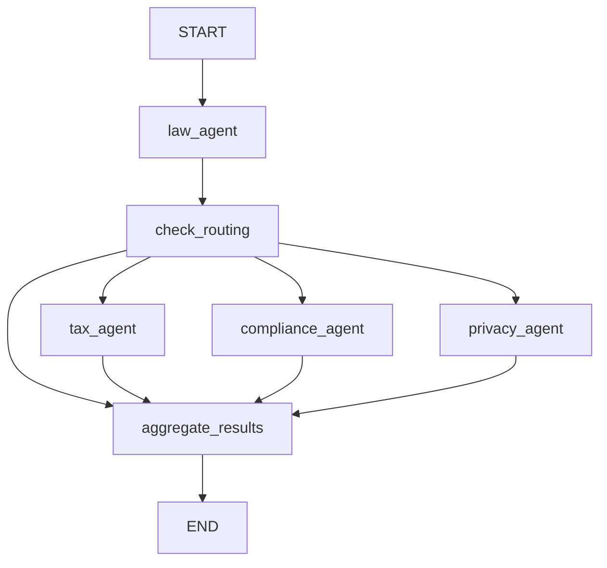
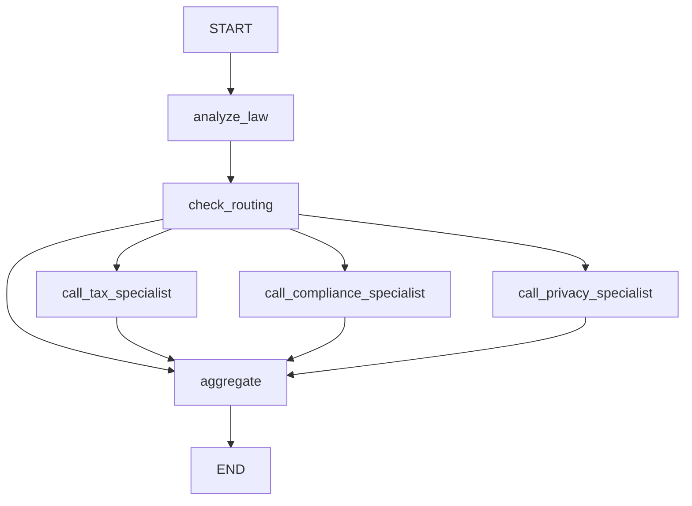
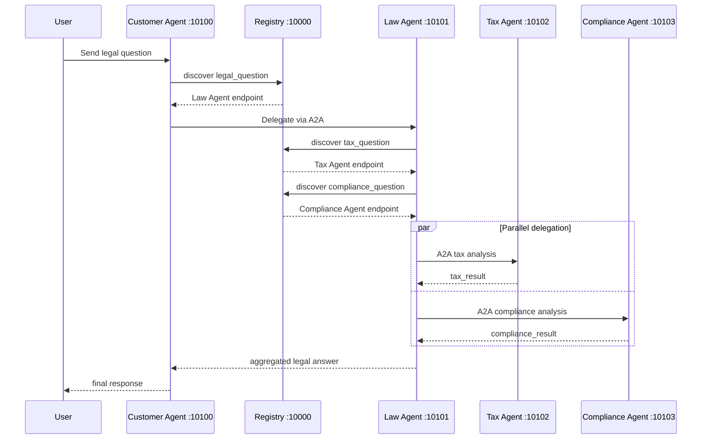

# SOLUTION - Batch02 Day9 Multi-Agent MCP/A2A Lab
- Generated at: `2026-06-09T16:42:23`
- Project root: `D:\AI20k\lab9\Batch02-Day9_Multi-Agent_MCP-A2A`
- LLM config: uses `OPENAI_API_KEY` / `OPENAI_MODEL` through `common/llm.py`; API key is not recorded here.
## Graphs
### Stage 4 Exercise Graph

### Stage 4 Demo Graph

### Stage 5 A2A Sequence

## Written Answers
### Stage 1
- `get_llm()` creates a `ChatOpenAI` client configured by environment variables.
- Messages are a list of `SystemMessage` plus `HumanMessage`.
- `SystemMessage` sets role/instructions; `HumanMessage` contains the user question.
- Temperature control was added in `common/llm.py` with `temperature=0.3`.
### Stage 2
- `@tool` wraps Python functions so the LLM can request them through tool calling.
- `LEGAL_KNOWLEDGE` is a list of dictionaries containing `id`, `keywords`, and `text`.
- Tools are bound through `llm.bind_tools(tools)` and executed manually from `response.tool_calls`.
- Added `labor_law` and `check_statute_of_limitations`.
### Stage 3
- `create_react_agent()` replaces the manual tool loop from Stage 2.
- The agent can Think, Act, Observe repeatedly until it has enough context.
- Added `search_case_law` and tested a breach-of-contract question.
- Enabled verbose/debug reasoning with `VERBOSE = True` and `debug=VERBOSE` in `create_react_agent()`. This LangGraph version uses `debug` instead of a `verbose` parameter.
### Stage 4
- `StateGraph` defines shared state and graph nodes.
- `Send()` dispatches specialist agents in parallel.
- Added `privacy_agent`, privacy routing, graph node/edge, and aggregation.
### Stage 5
- Registry is needed so agents discover capabilities dynamically instead of hardcoding URLs.
- Depth guards prevent infinite delegation loops.
- A2A provides a common agent communication contract over HTTP; REST/gRPC alone do not define agent cards, task semantics, or delegation flow.
- Tax Agent behavior was modified to answer concisely under 120 words with bullet points.
### Latency Improvement Proposal
- Keep specialist prompts short and enforce short outputs.
- Cache Registry discovery results for `tax_question`, `compliance_question`, and `legal_question`.
- Use a faster model for specialist agents.
- Preserve LangGraph parallel delegation with `Send()`.

### Optional Challenge Completed - Retry Logic
- Selected optional challenge: **Implement retry logic**.
- Implemented in `common/a2a_client.py`.
- A2A delegation now retries up to 3 attempts with exponential backoff: 1s, then 2s.
- Each retry keeps the same `trace_id`, `context_id`, and `delegation_depth` metadata so failures remain traceable.
- This is low risk because it only wraps outbound A2A calls; it does not alter graph topology, prompts, Registry data, or agent cards.
## Captured Runs
### Syntax check
```powershell
D:\AI20k\lab9\Batch02-Day9_Multi-Agent_MCP-A2A\.venv\Scripts\python.exe -m py_compile common/llm.py exercises/exercise_2_tools.py stages/stage_3_single_agent/main.py exercises/exercise_4_multiagent.py stages/stage_4_milti_agent/main.py tax_agent/graph.py
```
- Return code: `0`
- Duration: `0.18s`
```text
(no output)
```
### Stage 1 - Direct LLM
```powershell
D:\AI20k\lab9\Batch02-Day9_Multi-Agent_MCP-A2A\.venv\Scripts\python.exe stages/stage_1_direct_llm/main.py
```
- Return code: `0`
- Duration: `13.19s`
```text
======================================================================
STAGE 1: Direct LLM Calling
======================================================================

[How it works]
  1. We send a system prompt + user question directly to the LLM
  2. The LLM responds from its training data only
  3. No tools, no retrieval, no external knowledge

Question: Công ty có thể đơn phương chấm dứt hợp đồng lao động khi nào?
----------------------------------------------------------------------

>>> Calling LLM directly (no tools, no RAG)...

Theo Bộ luật Lao động Việt Nam 2019, công ty có thể đơn phương chấm dứt hợp đồng lao động trong một số trường hợp cụ thể:

1. **Người lao động vi phạm nghĩa vụ**: Nếu người lao động có hành vi vi phạm nghiêm trọng nội quy lao động, không thực hiện đúng công việc đã thỏa thuận, hoặc có hành vi gian dối trong việc ký kết hợp đồng.

2. **Người lao động không đủ khả năng làm việc**: Khi người lao động không còn đủ khả năng làm việc do sức khỏe hoặc lý do khác, và đã được xác nhận bởi cơ sở y tế có thẩm quyền.

3. **Thay đổi cơ cấu tổ chức**: Trong trường hợp công ty thay đổi cơ cấu tổ chức, công nghệ hoặc lý do kinh tế, dẫn đến việc không còn nhu cầu sử dụng lao động.

4. **Người lao động không có mặt tại nơi làm việc**: Nếu người lao động vắng mặt liên tục trong thời gian quy định mà không có lý do chính đáng.

5. **Nguyên nhân khác**: Các lý do khác theo quy định của pháp luật hoặc thỏa thuận trong hợp đồng lao động.

Công ty cần tuân thủ quy trình thông báo và thời gian báo trước theo quy định của pháp luật, thường là từ 30 đến 45 ngày, tùy thuộc vào loại hợp đồng lao động. Việc chấm dứt hợp đồng lao động không đúng quy định có thể dẫn đến trách nhiệm bồi thường cho người lao động.

----------------------------------------------------------------------
[Limitations of Stage 1]
  - Stateless: no conversation memory between calls
  - No tools: cannot search databases or calculate damages
  - Knowledge cutoff: only knows what was in training data
  - No grounding: cannot cite specific statutes or current case law

Next: Stage 2 adds RAG and tools to ground responses in real data.
======================================================================
```
### Stage 2 - Exercise Tools
```powershell
D:\AI20k\lab9\Batch02-Day9_Multi-Agent_MCP-A2A\.venv\Scripts\python.exe exercises/exercise_2_tools.py
```
- Return code: `0`
- Duration: `7.97s`
```text
Nhập câu hỏi pháp lý: Câu hỏi: Thời hiệu khởi kiện vụ vi phạm hợp đồng là bao lâu?

🔧 Gọi tool: check_statute_of_limitations

✅ Kết quả:
Thời hiệu khởi kiện vụ vi phạm hợp đồng là 4 năm, theo quy định của UCC § 2-725.
```
### Stage 3 - ReAct Agent
```powershell
D:\AI20k\lab9\Batch02-Day9_Multi-Agent_MCP-A2A\.venv\Scripts\python.exe stages/stage_3_single_agent/main.py
```
- Return code: `0`
- Duration: `19.05s`
```text
D:\AI20k\lab9\Batch02-Day9_Multi-Agent_MCP-A2A\stages\stage_3_single_agent\main.py:233: LangGraphDeprecatedSinceV10: create_react_agent has been moved to `langchain.agents`. Please update your import to `from langchain.agents import create_agent`. Deprecated in LangGraph V1.0 to be removed in V2.0.
  graph = create_react_agent(model=llm, tools=TOOLS, prompt=SYSTEM_PROMPT)
======================================================================
STAGE 3: Single Agent (ReAct Loop)
======================================================================

[How it works]
  1. An autonomous agent receives a complex multi-part question
  2. It reasons about what tools to call (Think)
  3. It calls a tool (Act)
  4. It observes the result and decides next steps (Observe)
  5. It repeats until it has enough information for a final answer

Question: A software vendor intentionally breached a $250,000 contract and the client wants damages. Which remedies and case law apply?
----------------------------------------------------------------------

[Step 1] THINK + ACT (node: agent)
  Tool: search_legal_database
  Args: {'query': 'breach of contract remedies damages software vendor'}
  Tool: search_case_law
  Args: {'keywords': 'breach of contract damages software vendor'}

[Step 2] OBSERVE (node: tools)
  Result: [contract_remedies] UCC Article 2 remedies: expectation damages, consequential damages (Hadley v. Baxendale), specific performance for unique goods, cover damages. Statute of limitations: 4 years (UCC § 2-725).

[nda_breach] NDA breaches trigger contractual and statutory liability. Under the DTSA (1...

[Step 3] OBSERVE (node: tools)
  Result: Hadley v. Baxendale (1854) - Consequential damages

[Step 4] FINAL ANSWER (node: agent)
----------------------------------------------------------------------
In the case of a software vendor intentionally breaching a $250,000 contract, the client has several remedies available under contract law. The primary remedies for breach of contract include:

1. **Expectation Damages**: This is the most common remedy, aiming to put the injured party in the position they would have been in had the contract been performed. In this case, the client could seek the full contract amount of $250,000 as expectation damages.

2. **Consequential Damages**: These damages cover losses that are not directly caused by the breach but are a foreseeable result of it. The landmark case **Hadley v. Baxendale** established that consequential damages can be claimed if they were within the contemplation of both parties at the time of the contract formation.

3. **Specific Performance**: In some cases, particularly when the subject matter of the contract is unique (such as custom software), a court may order specific performance, compelling the vendor to fulfill their contractual obligations.

4. **Cover Damages**: If the client had to procure a substitute for the software, they could claim the difference between the cost of cover and the original contract price.

5. **Attorney's Fees**: Depending on the contract terms, the client may also seek recovery of attorney's fees incurred in enforcing the contract.

### Relevant Case Law
- **Hadley v. Baxendale (1854)**: This case is pivotal in establishing the principle of consequential damages. It ruled that damages must be foreseeable and within the contemplation of the parties when the contract was made.

### Statute of Limitations
It's important to note that under the Uniform Commercial Code (UCC) § 2-725, the statute of limitations for bringing a breach of contract claim is four years from the date of the breach.

### Conclusion
The client can pursue expectation damages of $250,000, potentially plus consequential damages if they can demonstrate that such damages were foreseeable. They should also consider the possibility of specific performance if applicable. Legal counsel should be engaged to assess the specifics of the case and to navigate the claims effectively, including any potential for recovering attorney's fees.

----------------------------------------------------------------------
[Improvements over Stage 2]
  + Autonomous: agent decides which tools to call and when
  + Multi-step reasoning: can search, calculate, search again
  + Handles complex queries: breaks problems into sub-tasks

[Limitations of Stage 3]
  - Single agent: one LLM handles all domains (law, tax, compliance)
  - No specialisation: same system prompt for all legal areas
  - Bottleneck: sequential tool calls, no parallelism

Next: Stage 4 splits this into specialised agents that work in parallel.
======================================================================
```
### Stage 4 - Exercise Multi-Agent
```powershell
D:\AI20k\lab9\Batch02-Day9_Multi-Agent_MCP-A2A\.venv\Scripts\python.exe exercises/exercise_4_multiagent.py
```
- Return code: `0`
- Duration: `68.01s`
```text
======================================================================
MULTI-AGENT SYSTEM với Privacy Agent
======================================================================

Câu hỏi: Nếu công ty bị rò rỉ dữ liệu khách hàng, hậu quả pháp lý và thuế là gì?

Đang xử lý qua các agents...


======================================================================
KẾT QUẢ CUỐI CÙNG
======================================================================
# Báo cáo Pháp lý về Hậu quả của Việc Rò rỉ Dữ liệu Khách hàng

## I. Giới thiệu
Việc rò rỉ dữ liệu khách hàng là một vấn đề nghiêm trọng mà các công ty có thể phải đối mặt. Hậu quả pháp lý và thuế từ sự cố này có thể rất nghiêm trọng, ảnh hưởng đến danh tiếng, tài chính và hoạt động của công ty. Báo cáo này tổng hợp các phân tích pháp lý liên quan đến hậu quả của việc rò rỉ dữ liệu khách hàng.

## II. Hậu quả Pháp lý

### 1. Hợp đồng
- **Vi phạm hợp đồng**: Rò rỉ dữ liệu có thể dẫn đến vi phạm hợp đồng với khách hàng hoặc đối tác, cho phép họ yêu cầu bồi thường hoặc chấm dứt hợp đồng.
- **Điều khoản bảo mật**: Nếu không tuân thủ các điều khoản bảo mật trong hợp đồng, công ty có thể bị kiện và phải bồi thường.

### 2. Trách nhiệm dân sự
- **Bồi thường thiệt hại**: Công ty có thể phải bồi thường cho khách hàng nếu việc rò rỉ dữ liệu gây thiệt hại cho họ.
- **Trách nhiệm pháp lý**: Vi phạm quy định bảo vệ dữ liệu như GDPR có thể dẫn đến hình phạt hành chính hoặc hình sự.

### 3. Quyền và Nghĩa vụ Pháp lý
- **Nghĩa vụ thông báo**: Công ty phải thông báo cho cơ quan chức năng và khách hàng trong thời gian quy định về việc rò rỉ dữ liệu.
- **Quyền của khách hàng**: Khách hàng có quyền yêu cầu thông tin về việc rò rỉ và bồi thường nếu bị thiệt hại.
- **Nghĩa vụ khắc phục**: Công ty có trách nhiệm khắc phục hậu quả và cải thiện biện pháp bảo mật.

## III. Hậu quả Thuế

### 1. Chi phí phát sinh
- **Chi phí xử lý sự cố**: Các chi phí như pháp lý, thông báo và khôi phục hệ thống có thể làm giảm lợi nhuận và ảnh hưởng đến nghĩa vụ thuế.

### 2. Khấu trừ thuế
- **Khấu trừ chi phí hợp lý**: Một số chi phí liên quan đến việc khắc phục sự cố có thể được khấu trừ thuế, nhưng công ty cần lưu giữ chứng từ hợp lệ.

### 3. Hình phạt và Trách nhiệm thuế
- **Hình phạt do không tuân thủ**: Không thông báo kịp thời có thể dẫn đến hình phạt hành chính, ảnh hưởng đến tài chính và nghĩa vụ thuế.
- **Trách nhiệm về thuế**: Các khoản bồi thường không được khấu trừ thuế có thể làm tăng nghĩa vụ thuế.

### 4. Các quy định quốc tế
- **FBAR và FATCA**: Nếu có tài khoản nước ngoài, công ty cần tuân thủ các quy định quốc tế để tránh hình phạt.

## IV. Kết luận
Việc rò rỉ dữ liệu khách hàng có thể dẫn đến nhiều hậu quả pháp lý và thuế nghiêm trọng. Công ty cần đầu tư vào các biện pháp bảo mật hiệu quả và tuân thủ quy định pháp luật để giảm thiểu rủi ro. Việc quản lý chi phí phát sinh và đảm bảo chứng từ hợp lệ là rất quan trọng để duy trì tình hình tài chính ổn định và tuân thủ nghĩa vụ thuế.

======================================================================
```
### Stage 4 - Demo Multi-Agent
```powershell
D:\AI20k\lab9\Batch02-Day9_Multi-Agent_MCP-A2A\.venv\Scripts\python.exe stages/stage_4_milti_agent/main.py
```
- Return code: `0`
- Duration: `31.65s`
```text
D:\AI20k\lab9\Batch02-Day9_Multi-Agent_MCP-A2A\stages\stage_4_milti_agent\main.py:141: LangGraphDeprecatedSinceV10: Importing Send from langgraph.constants is deprecated. Please use 'from langgraph.types import Send' instead. Deprecated in LangGraph V1.0 to be removed in V2.0.
  from langgraph.constants import Send
D:\AI20k\lab9\Batch02-Day9_Multi-Agent_MCP-A2A\stages\stage_4_milti_agent\main.py:263: LangGraphDeprecatedSinceV10: create_react_agent has been moved to `langchain.agents`. Please update your import to `from langchain.agents import create_agent`. Deprecated in LangGraph V1.0 to be removed in V2.0.
  agent = create_react_agent(model=llm, tools=[search_tax_law], prompt=tax_prompt)
D:\AI20k\lab9\Batch02-Day9_Multi-Agent_MCP-A2A\stages\stage_4_milti_agent\main.py:285: LangGraphDeprecatedSinceV10: create_react_agent has been moved to `langchain.agents`. Please update your import to `from langchain.agents import create_agent`. Deprecated in LangGraph V1.0 to be removed in V2.0.
  agent = create_react_agent(model=llm, tools=[search_compliance_law], prompt=compliance_prompt)
D:\AI20k\lab9\Batch02-Day9_Multi-Agent_MCP-A2A\stages\stage_4_milti_agent\main.py:307: LangGraphDeprecatedSinceV10: create_react_agent has been moved to `langchain.agents`. Please update your import to `from langchain.agents import create_agent`. Deprecated in LangGraph V1.0 to be removed in V2.0.
  agent = create_react_agent(model=llm, tools=[search_privacy_law], prompt=privacy_prompt)
======================================================================
STAGE 4: Multi-Agent System (In-Process)
======================================================================

[How it works]
  1. Lead attorney agent analyses the question
  2. Router decides which specialist agents are needed
  3. Tax + Compliance + Privacy specialists run IN PARALLEL (LangGraph Send API)
  4. Aggregator combines all analyses into a final answer

[Graph topology]
  analyze_law -> check_routing -> [call_tax + call_compliance + call_privacy] -> aggregate -> END

Question: If a company suffers a customer data breach and also avoids taxes on overseas revenue, what are the legal, privacy, tax, and regulatory consequences?
----------------------------------------------------------------------

  [Node: analyze_law] Lead attorney analysing legal aspects...
  [Node: analyze_law] Done (1152 chars)

  [Node: check_routing] Determining which specialists are needed...
  [Node: check_routing] needs_tax=True, needs_compliance=True, needs_privacy=True

  [Node: call_tax_specialist] Tax specialist agent starting...

  [Node: call_compliance_specialist] Compliance specialist agent starting...

  [Node: call_privacy_specialist] Privacy specialist agent starting...
  [Node: call_tax_specialist] Done (996 chars)
  [Node: call_compliance_specialist] Done (1012 chars)
  [Node: call_privacy_specialist] Done (1169 chars)

  [Node: aggregate] Combining all specialist analyses...
  [Node: aggregate] Done (3182 chars)

======================================================================
FINAL ANSWER
======================================================================
# Comprehensive Legal and Regulatory Analysis

## I. Overview of Legal Risks

A customer data breach exposes a company to significant legal liabilities under various data protection laws, primarily the General Data Protection Regulation (GDPR) and the California Consumer Privacy Act (CCPA). These laws impose stringent requirements on the handling of personal data, and non-compliance can lead to severe penalties, including civil fines, lawsuits from affected customers, and regulatory scrutiny.

Additionally, if the company is found to be evading taxes on overseas revenue, it faces serious repercussions. Tax evasion is classified as a felony under U.S. law, carrying potential fines of up to $250,000 and imprisonment for up to five years. Civil penalties can include a 75% penalty on the underpayment of taxes and fines for failure to file necessary tax documents.

## II. Consequences of Data Breach

### A. Regulatory Compliance
In the event of a data breach, the company must adhere to specific notification requirements. Under the GDPR, the company is obligated to notify supervisory authorities within 72 hours of becoming aware of a breach. Penalties for non-compliance can reach €20 million or 4% of global annual turnover. The CCPA allows consumers to seek statutory damages ranging from $100 to $750 per affected individual per incident, adding to the financial burden.

### B. Reputational Damage
The fallout from a data breach can severely damage the company’s reputation, leading to loss of customer trust and potential long-term impacts on business operations. Increased scrutiny from regulatory bodies may result in audits and further investigations, compounding the company's legal exposure.

## III. Consequences of Tax Evasion

### A. Legal Penalties
If the company is found guilty of tax evasion, it may face substantial penalties, including back taxes owed, interest, and fines. The IRS can impose significant penalties for failure to report foreign income accurately, which may lead to additional scrutiny and reputational harm.

### B. Criminal Charges
In severe cases, responsible individuals within the company could face criminal charges, further exacerbating the legal and financial implications for the organization.

## IV. Interplay Between Data Protection and Tax Compliance

The intersection of data protection laws and tax compliance creates a dual threat for the company. Regulatory authorities may coordinate their enforcement actions, leading to more comprehensive investigations that encompass both data privacy and tax obligations. This interconnected scrutiny can amplify the company's legal exposure and necessitate a robust compliance strategy.

## V. Conclusion

In summary, the company faces significant financial and reputational risks stemming from both a customer data breach and potential tax evasion. To mitigate these risks, it is imperative for the company to implement comprehensive compliance strategies that address both data protection and tax obligations. Proactive measures will not only help in avoiding legal penalties but also in maintaining customer trust and safeguarding the company's reputation in the marketplace.

----------------------------------------------------------------------
[Improvements over Stage 3]
  + Specialisation: each agent has domain-specific expertise
  + Parallel execution: tax + compliance agents run concurrently
  + Better quality: specialist prompts produce deeper analysis
  + Structured flow: explicit graph topology with routing logic

[Stage 4 (Monolith) vs Stage 5 (Distributed A2A)]
  +---------------------------+-------------------------------+
  | Stage 4 (In-Process)      | Stage 5 (A2A Protocol)        |
  +---------------------------+-------------------------------+
  | Single process            | Multiple services (ports)     |
  | Direct function calls     | HTTP-based A2A protocol       |
  | Shared memory             | Message passing               |
  | Simple deployment         | Independent scaling           |
  | Tight coupling            | Loose coupling                |
  | Easy to debug             | Service discovery + registry  |
  | Good for small teams      | Good for large organisations  |
  +---------------------------+-------------------------------+

Stage 5 (this repo's main project) takes this same graph topology
and deploys each agent as an independent A2A service. Run it with:
  ./start_all.sh && python test_client.py
======================================================================
```
## Stage 5 - Distributed A2A System
### Registry Snapshot
Registry already had all required agents. This run reused the existing VS Code terminal services.
```json
{
  "agents": [
    {
      "agent_name": "tax-agent",
      "version": "1.0",
      "description": "Specialist tax attorney and CPA agent for tax law questions",
      "tasks": [
        "tax_question"
      ],
      "endpoint": "http://localhost:10102",
      "tags": [
        "tax",
        "irs",
        "tax-evasion",
        "penalties"
      ],
      "registered_at": "2026-06-09T08:53:42.928160+00:00"
    },
    {
      "agent_name": "compliance-agent",
      "version": "1.0",
      "description": "Regulatory compliance officer for SEC, SOX, FCPA, AML, and related topics",
      "tasks": [
        "compliance_question"
      ],
      "endpoint": "http://localhost:10103",
      "tags": [
        "compliance",
        "regulatory",
        "sec",
        "sox",
        "aml",
        "fcpa"
      ],
      "registered_at": "2026-06-09T08:53:51.365511+00:00"
    },
    {
      "agent_name": "law-agent",
      "version": "1.0",
      "description": "Legal orchestrator: contract law, delegating to tax and compliance agents",
      "tasks": [
        "legal_question"
      ],
      "endpoint": "http://localhost:10101",
      "tags": [
        "legal",
        "contract",
        "law",
        "orchestrator"
      ],
      "registered_at": "2026-06-09T08:54:11.426030+00:00"
    },
    {
      "agent_name": "customer-agent",
      "version": "1.0",
      "description": "Entry-point legal assistant; routes user questions to the Law Agent",
      "tasks": [],
      "endpoint": "http://localhost:10100",
      "tags": [
        "customer",
        "entry-point",
        "legal-assistant"
      ],
      "registered_at": "2026-06-09T08:54:39.863219+00:00"
    }
  ]
}
```
### End-to-End Test and Latency
### Stage 5 test_client.py
```powershell
D:\AI20k\lab9\Batch02-Day9_Multi-Agent_MCP-A2A\.venv\Scripts\python.exe test_client.py
```
- Return code: `0`
- Duration: `74.58s`
```text
D:\AI20k\lab9\Batch02-Day9_Multi-Agent_MCP-A2A\test_client.py:49: DeprecationWarning: A2AClient is deprecated and will be removed in a future version. Use ClientFactory to create a client with a JSON-RPC transport.
  client = A2AClient(httpx_client=http_client, agent_card=agent_card)
Connecting to Customer Agent at http://localhost:10100
Question: If a company breaks a contract and avoids taxes, what are the legal and regulatory consequences?
------------------------------------------------------------
Connected to agent: Customer Agent v1.0.0
------------------------------------------------------------
Sending request (this may take 30-60s while agents chain)...

RESPONSE:
============================================================
When a company breaks a contract and engages in tax evasion, it faces significant legal and regulatory consequences across various dimensions. Here’s a comprehensive overview:

### 1. Breach of Contract

- **Legal Framework**: A breach occurs when one party fails to fulfill its contractual obligations. The aggrieved party may seek:
  - **Damages**: Compensation for losses incurred.
  - **Specific Performance**: A court order to fulfill contractual obligations.
  - **Rescission**: Declaration that the contract is void.

- **Consequences**:
  - **Civil Lawsuits**: The non-breaching party can file a lawsuit for remedies.
  - **Reputational Damage**: Breaching a contract can harm the company’s reputation, affecting future business opportunities.

### 2. Tax Evasion

- **Legal Framework**: Tax evasion involves deliberately misrepresenting or concealing information to reduce tax liability. This includes underreporting income or inflating deductions.

- **Consequences**:
  - **Criminal Penalties**: Conviction can lead to up to five years in prison and substantial fines (up to $250,000 for individuals and $500,000 for corporations).
  - **Civil Penalties**: The IRS may impose fines and interest for underpayment of taxes.
  - **Audits and Investigations**: Tax evasion can trigger audits by tax authorities.

### 3. Liability Exposure

- **Corporate Liability**: The corporation can be held liable for both breaches and tax evasion. Individual officers may face personal liability if they knowingly participated in these acts.
- **Regulatory Consequences**: Regulatory bodies, like the SEC, may investigate and impose sanctions, including fines and operational restrictions.

### 4. Potential Defenses and Mitigating Factors

- **Defenses to Breach of Contract**: Possible defenses include impossibility or mutual mistake, though these are often narrowly construed.
- **Mitigating Factors for Tax Evasion**:
  - **Good Faith**: Acting in good faith or misunderstanding tax obligations may mitigate penalties.
  - **Voluntary Disclosure**: Disclosing breaches or tax issues can reduce penalties.
  - **Cooperation**: Full cooperation during investigations may lead to reduced penalties.
  - **Compliance Programs**: Implementing effective compliance measures can help mitigate liability.

### 5. Cross-Border Regulatory Exposure
For multinational companies, breaches and tax evasion can lead to jurisdictional issues and potential double taxation, complicating compliance with both domestic and foreign laws.

### Conclusion
In summary, a company that breaches a contract and engages in tax evasion exposes itself to severe legal and regulatory consequences, including civil and criminal penalties, reputational harm, and potential personal liability for executives. It is crucial for companies to maintain compliance with both contractual obligations and tax laws to mitigate these risks.

For specific legal advice tailored to your situation, it is recommended to consult with licensed attorneys.
============================================================
```
Measured client-side latency: `74.58s`
### Stage 5.1 - Trace Request Flow
Stage 5.1 was verified after running the full A2A system with `start_all.sh` / equivalent VS Code terminals. The baseline `test_client.py` call completed successfully with return code `0` and connected to the Customer Agent at `http://localhost:10100`.

`test_client.py` was updated to generate and print trace metadata before sending the A2A request:

```text
trace_id: 164b8167-f1e6-4b72-a441-1c60a015e392
context_id: e2a64d5d-8421-42d7-80a0-868cee3f09b6
```

The same values are attached to the outgoing A2A message metadata:

```python
metadata={
    "trace_id": trace_id,
    "context_id": context_id,
    "delegation_depth": 0,
}
```

Observed request path:

```text
User/test_client.py
 -> Customer Agent (:10100)
 -> Registry (:10000) discover legal_question
 -> Law Agent (:10101)
 -> Registry (:10000) discover tax_question
 -> Tax Agent (:10102)
 -> Registry (:10000) discover compliance_question
 -> Compliance Agent (:10103)
 -> Law Agent aggregate
 -> Customer Agent
 -> User/test_client.py
```

Baseline test evidence:

```text
Connecting to Customer Agent at http://localhost:10100
Question: If a company breaks a contract and avoids taxes, what are the legal and regulatory consequences?
trace_id: 164b8167-f1e6-4b72-a441-1c60a015e392
context_id: e2a64d5d-8421-42d7-80a0-868cee3f09b6
Connected to agent: Customer Agent v1.0.0
Sending request (this may take 30-60s while agents chain)...
RESPONSE:
When a company breaches a contract and engages in tax evasion, it faces serious legal and regulatory consequences.
```

Registry evidence confirmed the following task routing:

```text
legal_question      -> law-agent         http://localhost:10101
tax_question        -> tax-agent         http://localhost:10102
compliance_question -> compliance-agent  http://localhost:10103
```

### Stage 5.2 - Dynamic Discovery / Tax Agent Failure Test
To test failure behavior, Tax Agent was stopped by killing the process listening on port `10102`:

```text
Stopped tax_agent PID=18776
```

After stopping Tax Agent, port `10102` no longer had a listening server. Registry still contained the previously registered `tax-agent`, showing the expected in-memory stale discovery entry:

```json
{
  "agent_name": "tax-agent",
  "tasks": ["tax_question"],
  "endpoint": "http://localhost:10102"
}
```

Then `test_client.py` was run again while Tax Agent was unavailable. The end-to-end request still completed with return code `0`, meaning the system degraded gracefully instead of crashing the Customer Agent request:

```text
Connecting to Customer Agent at http://localhost:10100
Connected to agent: Customer Agent v1.0.0
Sending request (this may take 30-60s while agents chain)...
RESPONSE:
When a company breaches a contract and engages in tax evasion, it faces significant legal and regulatory consequences.
```

Observed behavior:

- Registry discovery still returned the `tax-agent` endpoint because this lab Registry has no heartbeat or automatic deregistration.
- The Tax Agent HTTP endpoint was unavailable, so the tax-specialist A2A call could not be completed.
- The overall Customer -> Law -> response flow still returned a final answer, so the user-facing request did not fail completely.
- This demonstrates partial fault tolerance, but also shows a production gap: Registry should support health checks, stale-agent eviction, or retry/fallback routing.

After the test, Tax Agent was restarted and re-registered:

```text
Started tax_agent
TCP 0.0.0.0:10102 LISTENING
tax-agent registered_at: 2026-06-09T10:03:53.175704+00:00
```

### Service Logs Captured In This Run
Services were already running in external VS Code terminals, so this script could not capture their stdout. The file still records the Registry snapshot and `test_client.py` output above.
## Completion Checklist
- [x] Stage 1 answer and run captured
- [x] Stage 2 tools/knowledge-base answer and run captured
- [x] Stage 3 ReAct/case-law answer and run captured
- [x] Stage 3.2 verbose/debug reasoning enabled and verified
- [x] Stage 4 privacy multi-agent graph and run captured
- [x] Stage 5 Registry snapshot, sequence diagram, E2E test, and latency captured
- [x] Stage 5.1 trace request flow documented
- [x] Stage 5.2 dynamic discovery / Tax Agent failure test completed
- [x] Tax Agent behavior update recorded
- [x] Optional challenge completed: A2A retry logic with exponential backoff
